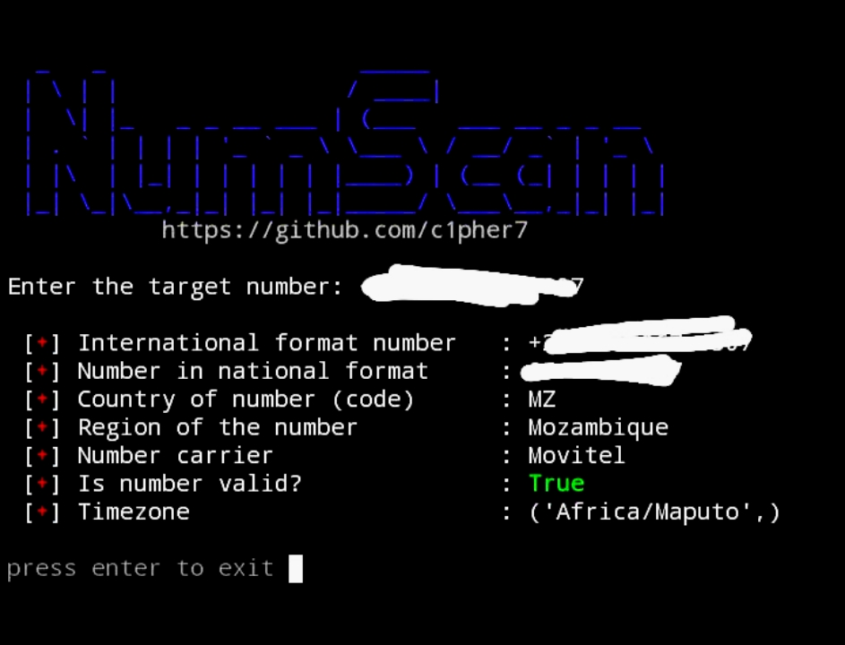

# NumScan

NumScan is a simple, fast and practical tool to obtain information from any phone number
# Info
How to use:
To put a phone number, you must first put the + in front and the country code, examples: (+55 | +1 | +91)
_________________________
After that, you can enter the telephone number in these two ways: (+5511912345678 | +55 11 912345678) see how many spaces you must enter according to the country corresponding to the telephone number!
_________________________
Works on:
 
 **[*] Termux ✓**
 
 **[*] Kali Linux ✓**
 
 **[*] Kali Nethunter ✓**
 
 **[*] Any other distro ✓**
 
 **[*] Windows (CMD) ❌**

_________________________

Information you will get with a phone number:

- Nacional format
- International format
- country
- region
- see if it's valid
- carrier
- time zone
# Screenshot

# Installation
For Termux:
```
apt update && apt upgrade -y

pkg install git

pkg install python

git clone https://github.com/c1pher7/NumScan

cd NumScan

pip install -r requirements.txt

python numscan.py
```
***⚠️ Warning: when starting the tool in termux an error may appear, ignore it and wait until the tool starts normally!***

For Kali Linux & Others:
```
sudo apt update && apt upgrade -y

sudo apt install git

sudo apt install python3

git clone https://github.com/c1pher7/NumScan

cd NumScan

pip3 install -r requirements.txt

python3 numscan.py
```
Legal notice: ***use this tool for educational purposes only, the creator will not be responsible if it is used in a way that harms anyone.***
